# Hi 👋, I'm Harsh Dubey

### MCA Student · Web Developer · AI & Full-Stack Enthusiast

Building practical web applications and AI-powered tools focused on learning, career preparation, and real-world developer workflows.

  <a href="https://github.com/HarshDubey79">GitHub</a>

---

## 👨‍💻 About Me

- 🎓 Pursuing **MCA** at **Lloyd Institute of Engineering and Technology**
- 💻 Focused on **Web Development, Full-Stack Development and AI-powered applications**
- 🤖 Interested in integrating AI into practical products and developer tools
- 🚀 Building projects that solve real-world problems
- 🌱 Continuously learning modern JavaScript, React, Next.js, backend development and AI technologies

## 🚀 Currently Building

### SkillNexAI — AI-Powered Job Preparation & Placement Platform

A full-stack placement-preparation platform designed to help students prepare for technical interviews and job opportunities.

**Core features:**
- 📄 Resume analysis
- 🎯 AI-generated technical questions
- 🎤 Voice-based mock interviews
- 📊 Interview feedback and evaluation
- 💼 Job-preparation workflows
- 🤖 AI-assisted learning and career preparation

## 🛠️ Tech Stack

**Languages:**
`C` `C++` `Java` `Python` `JavaScript` `HTML` `CSS`

**Frontend:**
`React.js` `Next.js` `Bootstrap` `Tailwind CSS`

**Backend:**
`Node.js` `Express.js` `Django` `Spring Boot`

**Database:**
`PostgreSQL` `SQL` `MongoDB`

**AI / ML:**
`Python` `NumPy` `Pandas` `Scikit-learn` `Google Gemini` `AI APIs`

**Tools & Cloud:**
`Git` `GitHub` `VS Code` `Docker` `AWS` `Azure`

## 📌 Featured Projects

| Project | Description |
|---|---|
| **SkillNexAI** | AI-powered job preparation and placement platform |
| **AI Resume Analyzer** | AI-assisted resume analysis and improvement workflow |
| **AI Code Reviewer** | Tool concept for AI-assisted code analysis and suggestions |
| **Portfolio Website** | Personal portfolio showcasing skills and projects |
| **EpicGadgetsHub** | E-commerce web application for electronic gadgets |

## 🎯 Current Focus

- Advanced **Next.js & React**
- AI integration and LLM-powered applications
- Full-stack application architecture
- PostgreSQL and backend development
- Cloud deployment and developer tooling
- Building portfolio-ready real-world projects

## �️ Animated Profile Art

  

  

## �📊 GitHub Activity

## 🔗 Connect

- GitHub: `https://github.com/HarshDubey79`
- LinkedIn: `https://www.linkedin.com/in/harsh-dubey-317556328/`
- Instagram: `https://instagram.com/harshdubey_._`
- X (Twitter): `https://x.com/HarshDubey7985`
- Email: `harshdubey3340@gmail.com`

---

**Building • Learning • Improving • Shipping 🚀**

# 💻 Tech Stack:
                     
# 📊 GitHub Stats:
 
 

### ✍️ Random Dev Quote

## 🐍 Snake Game

<!-- Proudly created with GPRM ( https://gprm.itsvg.in ) -->
